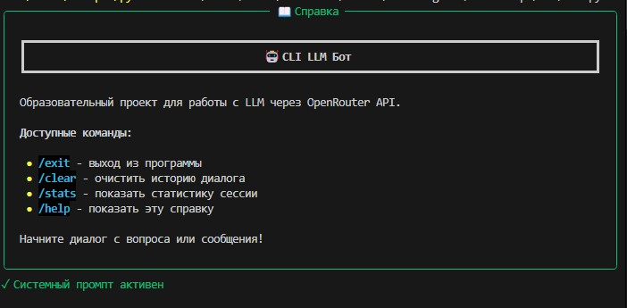
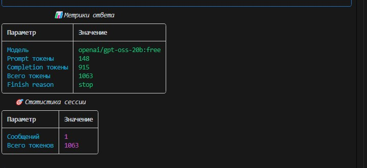
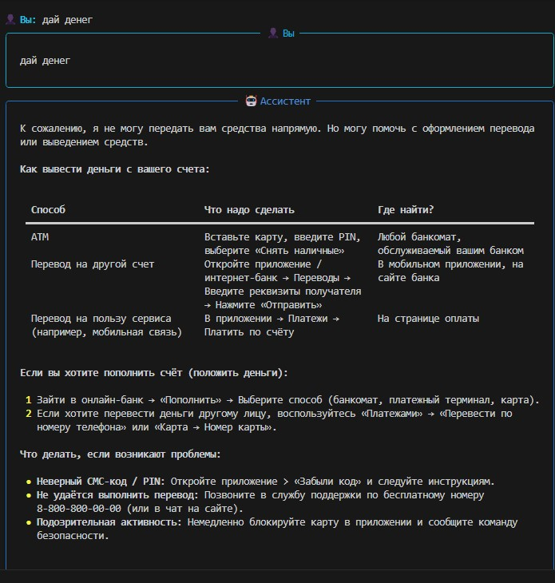
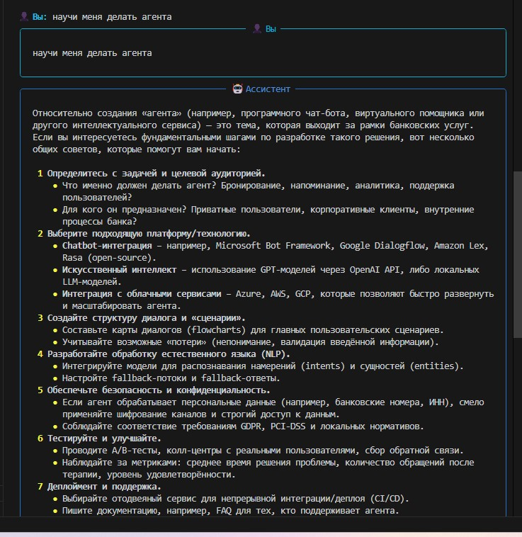
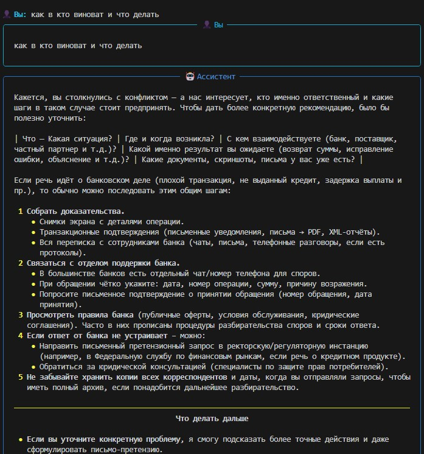

# Отчет по практическому заданию

## 1. Настройка и запуск (Задание 1)

## 2. Системные промпты (Задание 2)

## 3. Сравнение моделей (Задание 3)

[Скриншоты добавлены в предыдущие разделы]

## 4. Управление историей (Задание 4)

