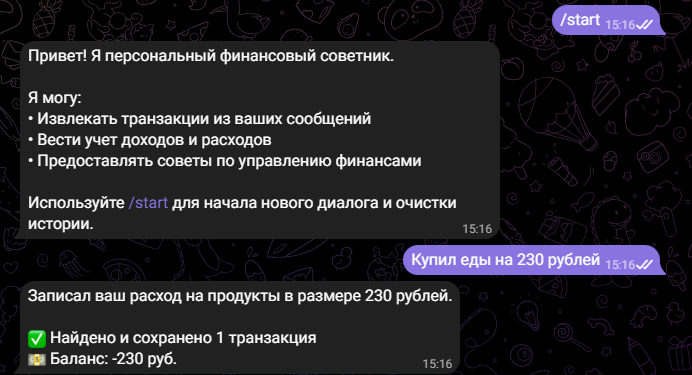

# Отчёт о выполнении задания

## Название проекта и краткое описание

**Персональный финансовый советник** — Telegram бот для учёта доходов и расходов с интеграцией LLM через OpenRouter или Ollama. Бот позволяет пользователям вести финансовый учёт, отправляя текстовые сообщения или изображения чеков, из которых автоматически извлекаются транзакции.

## Вариант задания

**Расширенный вариант** — реализована полная функциональность с поддержкой:
- Обработки текстовых сообщений
- Обработки изображений (чеки, скриншоты)
- Работы с локальными моделями через Ollama на облачном сервере
- Развёртывания на удалённом сервере

## Реализованные возможности

- ✅ Извлечение транзакций из текстовых сообщений
- ✅ Обработка изображений чеков и скриншотов (VLM)
- ✅ Автоматическая категоризация транзакций
- ✅ Отчёты о балансе и статистике по категориям
- ✅ История всех транзакций
- ✅ Поддержка локальных моделей через Ollama
- ✅ Развёртывание на облачном сервере
- ✅ Автозапуск через systemd
- ✅ Структурированный вывод (structured output) через JSON
- ✅ Контекстная обработка с учётом истории диалога
- ✅ Команды `/start`, `/balance`, `/transactions`

## Технологический стек

### Основные технологии

- **Python 3.11+** — основной язык разработки
- **uv** — менеджер зависимостей и виртуальных окружений
- **aiogram 3.x** — асинхронный фреймворк для Telegram Bot API
- **openai** — клиент для работы с LLM (единый интерфейс для OpenRouter и Ollama)
- **pydantic 2.x** — валидация данных и structured output для LLM
- **python-dotenv** — работа с переменными окружения

### Используемые модели LLM

**На облачном сервере (Ollama):**
- `qwen2.5:7b-instruct` (4.7 GB) — для обработки текста и изображений
- `llama3.2:1b` (1.3 GB) — дополнительная модель (установлена, но не используется)

**Поддержка других провайдеров:**
- OpenRouter API (настроено, но не используется в финальной версии)
- Модели: `openai/gpt-oss-20b:free`, `meta-llama/llama-3.2-11b-vision-instruct`

## Инструменты AI-driven разработки

### IDE и редакторы

- **Cursor** — AI-powered IDE с интеграцией LLM для автодополнения и рефакторинга
- **Git** — система контроля версий

### LLM модели для разработки

- **Claude Sonnet 4.5** (через Cursor) — для генерации кода, рефакторинга, отладки
- Использовались для:
  - Написания обработчиков сообщений
  - Интеграции с Ollama API
  - Решения проблем совместимости
  - Создания системных промптов
  - Настройки развёртывания

## Скриншоты работы




## Облачный сервер

### Провайдер и конфигурация

- **Провайдер:** immers.cloud
- **IP адрес:** 195.209.214.48
- **ОС:** Ubuntu 24.04 LTS
- **GPU:** NVIDIA GeForce RTX 4090
  - Память: 24 GB VRAM
  - Драйвер: 580.95.05
  - CUDA: 13.0

### Установленные сервисы

- **Ollama** — сервер для запуска локальных LLM моделей
  - Версия: последняя стабильная
  - Порт: 11434
  - Слушает на: 0.0.0.0:11434 (доступен извне после настройки)
  - Сервис: `ollama.service` (systemd)

- **Telegram Bot** — развёрнутый бот
  - Расположение: `/home/ubuntu/bot/`
  - Сервис: `telegram-bot.service` (systemd)
  - Автозапуск: включён
  - Виртуальное окружение: `/home/ubuntu/bot/venv/`

### Модели Ollama

1. **qwen2.5:7b-instruct** (4.7 GB)
   - Используется для обработки текстовых сообщений
   - Используется для обработки изображений
   - Квантование: Q4_K_M

2. **llama3.2:1b** (1.3 GB)
   - Установлена, но не используется в текущей конфигурации

## Основные вызовы и решения

### 1. Проблема совместимости Ollama с structured output

**Вызов:** Ollama не полностью поддерживает `response_format` с `json_schema` и `strict: True` в том же формате, что OpenAI API.

**Решение:**
- Добавлена автоматическая детекция провайдера (Ollama vs OpenRouter)
- Для Ollama используется обычный JSON mode (`json_object`) вместо `json_schema`
- Для OpenRouter сохраняется поддержка `json_schema` с `strict: True`
- Системные промпты содержат детальные инструкции по формату JSON

**Код:**
```python
# Автоматическое определение провайдера
is_ollama = "ollama" in config.OPENAI_BASE_URL.lower() or ":11434" in config.OPENAI_BASE_URL

if is_ollama:
    request_params["response_format"] = {"type": "json_object"}
else:
    request_params["response_format"] = {
        "type": "json_schema",
        "json_schema": {...}
    }
```

### 2. Проблема доступа к Ollama через firewall

**Вызов:** Порт 11434 на облачном сервере был недоступен извне из-за настроек firewall на уровне облачного провайдера.

**Решение:**
- Развёрнут бот непосредственно на сервере, где работает Ollama
- Изменён `OPENAI_BASE_URL` с `http://195.209.214.48:11434/v1` на `http://localhost:11434/v1`
- Бот и Ollama работают на одном сервере, что обеспечивает надёжное локальное подключение

### 3. Настройка автозапуска через systemd

**Вызов:** Необходимо обеспечить автоматический запуск бота при перезагрузке сервера и автоматический перезапуск при сбоях.

**Решение:**
- Создан systemd unit файл `/etc/systemd/system/telegram-bot.service`
- Настроены зависимости от `ollama.service` и `network-online.target`
- Включён автозапуск через `systemctl enable`
- Настроен автоматический перезапуск при сбоях (`Restart=always`)

### 4. Управление зависимостями на сервере

**Вызов:** На сервере используется Python 3.12 с externally-managed-environment, что требует использования виртуального окружения.

**Решение:**
- Создано виртуальное окружение через `python3 -m venv`
- Все зависимости установлены в venv
- Systemd сервис настроен на использование Python из venv

### 5. Конфликт нескольких экземпляров бота

**Вызов:** При запуске бота на сервере возник конфликт с локальным экземпляром, запущенным на Windows.

**Решение:**
- Остановлен локальный экземпляр бота на Windows
- Оставлен только один экземпляр на сервере через systemd
- Конфликт устранён, бот работает стабильно

## Что узнал нового

1. **Работа с Ollama и OpenAI-совместимым API**
   - Изучил различия в поддержке structured output между Ollama и OpenAI API
   - Научился адаптировать код для работы с разными провайдерами через единый интерфейс
   - Понял важность промпт-инжиниринга для получения корректного JSON при использовании обычного JSON mode

2. **Развёртывание на облачных серверах с GPU**
   - Освоил настройку Ollama на удалённом сервере с GPU
   - Изучил работу с systemd для создания сервисов с автозапуском
   - Научился управлять виртуальными окружениями Python на серверах с externally-managed-environment

3. **AI-driven разработка с Cursor**
   - Эффективно использовал AI-ассистента для генерации кода, отладки и рефакторинга
   - Научился формулировать запросы для получения нужного кода
   - Понял важность итеративного подхода при работе с AI-инструментами

4. **Структурированный вывод (Structured Output)**
   - Изучил использование Pydantic моделей для валидации ответов LLM
   - Понял разницу между `json_schema` с `strict: True` и обычным `json_object` mode
   - Научился обрабатывать ошибки парсинга и валидации данных от LLM

5. **Работа с Telegram Bot API через aiogram**
   - Освоил асинхронную обработку сообщений и изображений
   - Изучил работу с контекстом диалога и историей сообщений
   - Научился структурировать код обработчиков для поддержки разных типов контента

## Итоги

Проект успешно реализован и развёрнут на облачном сервере с GPU. Бот работает стабильно, обрабатывает текстовые сообщения и изображения, используя локальные модели через Ollama. Все основные функции реализованы, система готова к использованию.

**Статус:** ✅ Завершено и работает в production

