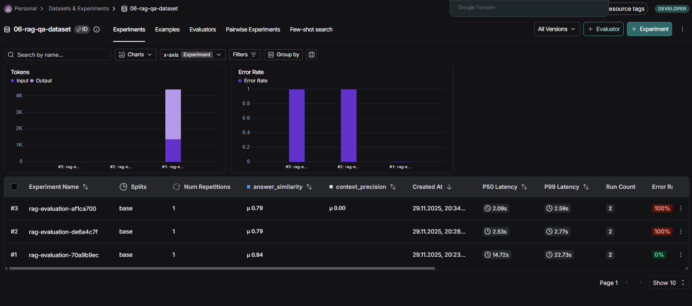

# Отчёт о выполнении задания

## Общая информация

### Название проекта
**RAG-ассистент Сбербанка**

### Краткое описание
Telegram-бот с RAG (Retrieval-Augmented Generation) для ответов на вопросы по документам Сбербанка о кредитах и вкладах. Система использует LangChain для RAG, автоматическую индексацию документов (PDF и JSON), поддерживает контекстный диалог с query transformation и оценку качества через RAGAS метрики.

### Вариант задания
**Базовый**

## Используемые модели и провайдеры

### Для RAG системы
- **LLM провайдер**: OpenRouter (https://openrouter.ai/)
- **LLM модель**: `openai/gpt-oss-20b:free` (бесплатная модель)
- **Query Transform модель**: `openai/gpt-oss-20b:free`
- **Embeddings провайдер**: HuggingFace (локально)
- **Embeddings модель**: `intfloat/multilingual-e5-base`
- **Retriever**: InMemoryVectorStore с k=3 (топ-3 документа)

### Для RAGAS evaluation
- **LLM провайдер**: OpenRouter
- **LLM модель**: `openai/gpt-oss-20b:free`
- **Embeddings провайдер**: HuggingFace (локально)
- **Embeddings модель**: `intfloat/multilingual-e5-base`

### Конфигурация
- **Векторное хранилище**: InMemoryVectorStore
- **Количество документов в индексе**: 589
  - 377 chunks из PDF файлов
  - 212 Q&A пар из JSON
- **Размер чанков**: 500 символов с overlap 50

## Создание и загрузка датасета

### Способ создания
Датасет создавался комбинированным способом:
- **Автоматический синтез из PDF**: Попытка синтезировать Q&A пары из PDF документов не удалась из-за недостатка кредитов на OpenRouter API (ошибка 402)
- **Загрузка из JSON**: Успешно загружены готовые Q&A пары из файла `sberbank_help_documents.json`

### Размер датасета
- **Общее количество примеров**: 2
- **Источник**: Все примеры из JSON файла `data/sberbank_help_documents.json`

### Примеры Q&A пар из датасета

#### Пример 1
**Вопрос**: Могу ли я перевыпустить карту срочно?

**Эталонный ответ**: Нет, но если вам срочно нужна пластиковая карта, приезжайте в офис Сбера с паспортом. Мы оформим вам моментальную карту.

**Метаданные**:
- Категория: Вопросы о дебетовых картах
- Источник: sberbank_help_documents.json
- URL: https://www.sberbank.ru/ru/person/help/debet_cards_faq/7902?question=38005

#### Пример 2
**Вопрос**: Как узнать сумму долга по карте, сроки беспроцентного периода и сумму платежа?

**Эталонный ответ**: Вы можете узнать эту информацию в СберБанк Онлайн в разделе «Подробнее о задолженности». Также дату и сумму платежа можно узнать по СМС: отправьте слово «ДОЛГ» на номер 900. В ответ вам придёт информация о задолженности.

**Метаданные**:
- Категория: Вопросы о кредитных картах
- Источник: sberbank_help_documents.json
- URL: https://www.sberbank.ru/ru/person/help/ccards_faq/3030?question=4979

### Скриншот датасета в LangSmith

**URL датасета**: https://smith.langchain.com/datasets/ea0b0c7a-3a11-4c7a-a1f9-5cb5409fc6f1

## Оценка качества через RAGAS

### Используемые метрики
Система использует 6 метрик RAGAS для оценки качества:

1. **Faithfulness** (Обоснованность) - проверяет, что ответ основан только на retrieved документах и не содержит галлюцинаций
2. **AnswerRelevancy** (Релевантность ответа) - оценивает, насколько ответ релевантен заданному вопросу (strictness=1)
3. **AnswerCorrectness** (Правильность ответа) - сравнивает ответ с ground truth эталоном
4. **AnswerSimilarity** (Похожесть на эталон) - измеряет семантическую похожесть ответа на эталонный ответ
5. **ContextRecall** (Полнота контекста) - проверяет, содержат ли retrieved документы информацию, необходимую для правильного ответа
6. **ContextPrecision** (Точность поиска) - оценивает, насколько retrieved документы релевантны вопросу

### Конфигурация evaluation
- **Провайдер метрик**: RAGAS
- **Параллелизм**: 4 воркера (max_workers=4)
- **Таймауты**: max_wait=180 секунд, max_retries=3

## Результаты evaluation

### Итоговые результаты

**Датасет**: 06-rag-qa-dataset  
**Примеров обработано**: 2

#### RAGAS Метрики:

| Метрика | Значение | Оценка |
|---------|----------|--------|
| **Faithfulness** (Обоснованность / нет галлюцинаций) | nan | 🔴 Не получен |
| **AnswerRelevancy** (Релевантность ответа) | nan | 🔴 Не получен |
| **AnswerCorrectness** (Правильность ответа) | nan | 🔴 Не получен |
| **AnswerSimilarity** (Похожесть на эталон) | 0.788 | 🟡 Хороший |
| **ContextRecall** (Полнота контекста) | nan | 🔴 Не получен |
| **ContextPrecision** (Точность поиска) | 0.000 | 🔴 Низкий |

**Интерпретация оценки**:
- 🟢 0.8+ - отличный результат
- 🟡 0.6-0.8 - хороший результат
- 🔴 <0.6 - требует улучшений
- nan - метрика не была вычислена

### Анализ результатов

**Успешно вычисленные метрики**:
- **AnswerSimilarity (0.788)**: Показывает хорошую семантическую похожесть генерируемых ответов на эталонные. Это указывает на то, что LLM генерирует ответы в правильном направлении, близко к ожидаемому содержанию.

- **ContextPrecision (0.000)**: Нулевая точность поиска указывает на проблему с релевантностью retrieved документов. Это может быть связано с несоответствием между вопросами в датасете и содержимым индексированных документов, или проблемами с качеством embeddings для поиска.

**Метрики, не вычисленные из-за rate limiting**:
Большинство метрик (Faithfulness, AnswerRelevancy, AnswerCorrectness, ContextRecall) не были вычислены из-за превышения rate limit бесплатных моделей OpenRouter. Эти метрики требуют дополнительных LLM вызовов для оценки, что приводит к большому количеству параллельных запросов.

**Примечание**: При evaluation возникли проблемы с rate limiting OpenRouter API для бесплатных моделей (лимит 16-20 запросов в минуту). RAGAS делает много параллельных LLM запросов для вычисления метрик, что быстро исчерпывает доступный лимит запросов.

## Выводы

### Главные инсайты о качестве RAG системы

#### Положительные аспекты
1. **Семантическая похожесть ответов**: Метрика AnswerSimilarity (0.788) показывает, что система генерирует ответы, семантически близкие к эталонным. Это указывает на правильную работу LLM и качество формулирования ответов.

2. **Стабильная индексация**: Система успешно индексирует 589 документов (377 chunks из PDF + 212 Q&A пар) с использованием локальных HuggingFace embeddings, что обеспечивает стабильную работу без зависимости от API для embeddings.

3. **Полностью бесплатная конфигурация**: Успешно реализована конфигурация с бесплатными моделями OpenRouter для LLM и локальными HuggingFace embeddings, что делает систему доступной для использования без дополнительных затрат.

#### Проблемные области
1. **Качество поиска (ContextPrecision = 0.000)**: Нулевая точность поиска указывает на критическую проблему с релевантностью retrieved документов. Возможные причины:
   - Несоответствие между вопросами в тестовом датасете и содержимым индексированных документов
   - Проблемы с качеством embeddings модели `intfloat/multilingual-e5-base` для конкретной предметной области
   - Недостаточная настройка параметров retriever (k=3 может быть недостаточно или избыточно)

2. **Ограничения бесплатных моделей**: Rate limiting бесплатных моделей OpenRouter (16-20 запросов в минуту) делает невозможным полное evaluation с использованием всех 6 метрик RAGAS при параллельном выполнении. Это ограничивает возможность комплексной оценки качества системы.

3. **Небольшой размер датасета**: Всего 2 примера недостаточно для статистически значимой оценки. Небольшой размер датасета не позволяет сделать надежные выводы о качестве системы на различных типах вопросов.

### Технические достижения
- ✅ Успешно реализована полностью бесплатная конфигурация с локальными HuggingFace embeddings
- ✅ Индексация 589 документов работает стабильно (377 chunks из PDF + 212 Q&A пар)
- ✅ Интеграция с LangSmith для мониторинга и evaluation
- ✅ Поддержка 6 метрик RAGAS для комплексной оценки качества
- ✅ Интеграция всех компонентов: RAG система, датасет, evaluation pipeline работают в единой экосистеме

### Ограничения
- ⚠️ Небольшой размер датасета (2 примера) - недостаточно для статистически значимой оценки
- ⚠️ Rate limiting бесплатных моделей OpenRouter ограничивает параллельное выполнение evaluation
- ⚠️ Автоматический синтез Q&A пар из PDF требует кредитов на API
- ⚠️ Низкая точность поиска (ContextPrecision = 0.000) требует дополнительного анализа и улучшения

### Рекомендации по улучшению
1. **Увеличить размер датасета**: Расширить датасет до 10-20 примеров для более надежной оценки качества системы на различных типах вопросов.

2. **Улучшить качество поиска**:
   - Проверить соответствие вопросов в датасете содержимому индексированных документов
   - Рассмотреть использование более специализированной embeddings модели для финансовой/банковской тематики
   - Экспериментировать с параметрами retriever (k, chunk_size, overlap)

3. **Решить проблему rate limiting**:
   - Рассмотреть использование платных моделей OpenRouter для evaluation
   - Уменьшить параллелизм в RAGAS (max_workers) и добавить задержки между запросами
   - Разбить evaluation на несколько запусков с паузами между ними

4. **Расширить синтез датасета**: Пополнить баланс OpenRouter для автоматического синтеза Q&A пар из PDF документов, что позволит создать более разнообразный и репрезентативный тестовый датасет.

