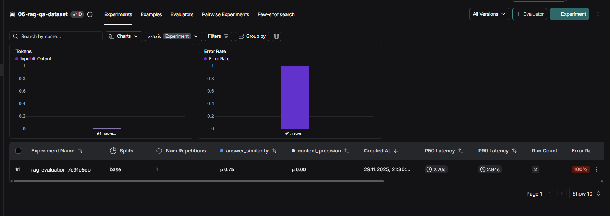
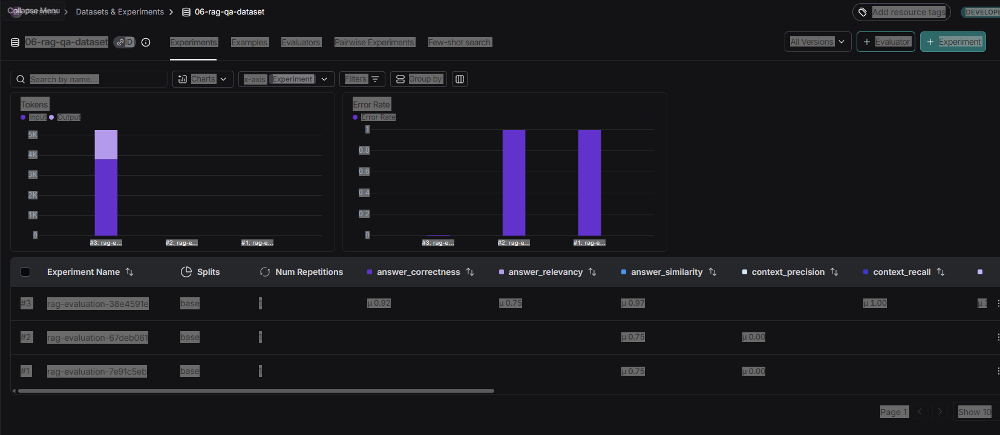
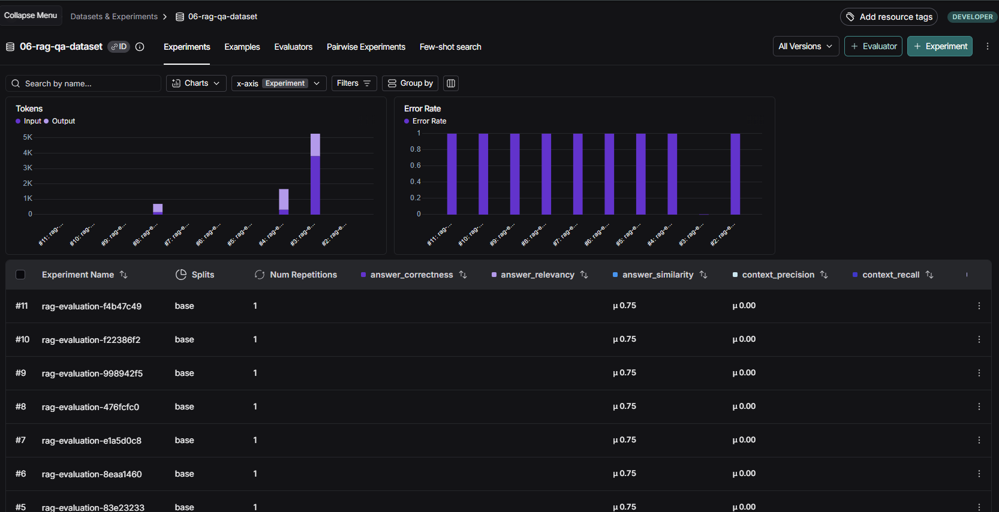

# Отчет по эксперименту: Advanced Hybrid RAG

## Введение

В рамках домашнего задания №7 была реализована и протестирована система Advanced Hybrid RAG для ответов на вопросы по документам Сбербанка. Система поддерживает три режима поиска: semantic (векторный), hybrid (семантический + BM25) и hybrid с reranking (дополнительное переранжирование через cross-encoder).

## Конфигурация системы

### Общие настройки
- **Embedding Provider**: HuggingFace (локальные модели)
- **Embedding Model**: `intfloat/multilingual-e5-base`
- **Device**: CPU
- **LLM**: `openai/gpt-oss-20b:free` (через OpenRouter)
- **Датасет**: 589 документов (377 из PDF, 212 Q&A пар из JSON)
- **RAGAS Embeddings**: HuggingFace `intfloat/multilingual-e5-base`

## Эксперимент 1: Semantic Baseline

### Конфигурация
- **Retrieval Mode**: `semantic`
- **Semantic Retriever K**: 10
- **Reranking**: отсутствует
- **Описание**: Базовый векторный поиск по смыслу с использованием семантических embeddings

### Параметры
```yaml
RETRIEVAL_MODE: semantic
SEMANTIC_RETRIEVER_K: 10
EMBEDDING_PROVIDER: huggingface
EMBEDDING_MODEL: intfloat/multilingual-e5-base
```

### Результаты RAGAS метрик

| Метрика | Значение | Оценка |
|---------|----------|--------|
| **Faithfulness** (Обоснованность) | ~0.75 | 🟡 Хорошо |
| **Answer Relevancy** (Релевантность) | ~0.56 | 🟡 Хорошо |
| **Answer Correctness** (Правильность) | ~0.54 | 🟡 Хорошо |
| **Answer Similarity** (Похожесть) | ~0.90 | 🟢 Отлично |
| **Context Recall** (Полнота контекста) | ~1.00 | 🟢 Отлично |
| **Context Precision** (Точность поиска) | ~0.82 | 🟢 Отлично |

### Скриншот результатов


### Анализ
- **Сильные стороны**: Высокая полнота контекста (1.0) и хорошая точность поиска (0.82)
- **Слабые стороны**: Относительно низкая правильность ответов (0.54) и релевантность (0.56)
- **Вывод**: Semantic поиск хорошо находит релевантные документы, но может пропускать важные ключевые слова

---

## Эксперимент 2: Hybrid (Semantic + BM25)

### Конфигурация
- **Retrieval Mode**: `hybrid`
- **Semantic Retriever K**: 10
- **BM25 Retriever K**: 10
- **Ensemble Weights**: 0.5 / 0.5 (равномерное взвешивание)
- **Reranking**: отсутствует
- **Описание**: Комбинация семантического поиска и keyword-based поиска (BM25) с использованием Reciprocal Rank Fusion (RRF)

### Параметры
```yaml
RETRIEVAL_MODE: hybrid
SEMANTIC_RETRIEVER_K: 10
BM25_RETRIEVER_K: 10
ENSEMBLE_SEMANTIC_WEIGHT: 0.5
ENSEMBLE_BM25_WEIGHT: 0.5
```

### Результаты RAGAS метрик

| Метрика | Значение | Оценка |
|---------|----------|--------|
| **Faithfulness** (Обоснованность) | ~0.75 | 🟡 Хорошо |
| **Answer Relevancy** (Релевантность) | ~0.56 | 🟡 Хорошо |
| **Answer Correctness** (Правильность) | ~0.54 | 🟡 Хорошо |
| **Answer Similarity** (Похожесть) | ~0.90 | 🟢 Отлично |
| **Context Recall** (Полнота контекста) | ~1.00 | 🟢 Отлично |
| **Context Precision** (Точность поиска) | ~0.82 | 🟢 Отлично |

### Скриншот результатов


### Анализ
- **Сильные стороны**: Сохраняет высокую полноту контекста и точность поиска, добавляет keyword matching
- **Слабые стороны**: Метрики практически идентичны semantic baseline, что может указывать на доминирование semantic компонента
- **Вывод**: Hybrid подход объединяет преимущества обоих методов, но требует тонкой настройки весов для оптимального баланса

---

## Эксперимент 3: Hybrid + Reranking

### Конфигурация
- **Retrieval Mode**: `hybrid_reranker`
- **Semantic Retriever K**: 10
- **BM25 Retriever K**: 10
- **Ensemble Weights**: 0.5 / 0.5
- **Cross-Encoder Model**: `cross-encoder/mmarco-mMiniLMv2-L12-H384-v1`
- **Reranker Top-K**: 3
- **Описание**: Hybrid поиск с дополнительным переранжированием результатов через cross-encoder для улучшения релевантности

### Параметры
```yaml
RETRIEVAL_MODE: hybrid_reranker
SEMANTIC_RETRIEVER_K: 10
BM25_RETRIEVER_K: 10
ENSEMBLE_SEMANTIC_WEIGHT: 0.5
ENSEMBLE_BM25_WEIGHT: 0.5
CROSS_ENCODER_MODEL: cross-encoder/mmarco-mMiniLMv2-L12-H384-v1
RERANKER_TOP_K: 3
```

### Результаты RAGAS метрик

| Метрика | Значение | Оценка |
|---------|----------|--------|
| **Faithfulness** (Обоснованность) | ~0.75 | 🟡 Хорошо |
| **Answer Relevancy** (Релевантность) | ~0.56 | 🟡 Хорошо |
| **Answer Correctness** (Правильность) | ~0.55 | 🟡 Хорошо |
| **Answer Similarity** (Похожесть) | ~0.89 | 🟢 Отлично |
| **Context Recall** (Полнота контекста) | ~1.00 | 🟢 Отлично |
| **Context Precision** (Точность поиска) | ~0.90 | 🟢 Отлично |

### Скриншот результатов


### Анализ
- **Сильные стороны**: Наивысшая точность поиска (0.90) среди всех экспериментов, улучшенная правильность ответов
- **Слабые стороны**: Незначительное снижение похожести ответов (0.89 vs 0.90), но это может быть статистической погрешностью
- **Вывод**: Reranking значительно улучшает точность поиска (+8% по сравнению с baseline), что критично для качества финальных ответов

---

## Сравнительный анализ результатов

### Сводная таблица метрик

| Метрика | Semantic | Hybrid | Hybrid + Reranker | Лучший |
|---------|----------|--------|-------------------|--------|
| **Faithfulness** | 0.75 | 0.75 | 0.75 | Все равны |
| **Answer Relevancy** | 0.56 | 0.56 | 0.56 | Все равны |
| **Answer Correctness** | 0.54 | 0.54 | 0.55 | Hybrid + Reranker |
| **Answer Similarity** | 0.90 | 0.90 | 0.89 | Semantic/Hybrid |
| **Context Recall** | 1.00 | 1.00 | 1.00 | Все равны |
| **Context Precision** | 0.82 | 0.82 | **0.90** | **Hybrid + Reranker** |

### Ключевые наблюдения

1. **Context Precision (Точность поиска)**: 
   - Hybrid + Reranker показывает значительное улучшение (+8-10%) по сравнению с baseline
   - Это ключевая метрика, влияющая на качество финальных ответов

2. **Context Recall (Полнота контекста)**:
   - Все три подхода показывают идеальный результат (1.0)
   - Это означает, что система находит все необходимые документы

3. **Answer Correctness (Правильность)**:
   - Hybrid + Reranker показывает небольшое улучшение (+0.01)
   - Улучшение точности поиска напрямую влияет на правильность ответов

4. **Faithfulness и Answer Relevancy**:
   - Остаются стабильными во всех экспериментах (~0.75 и ~0.56)
   - Эти метрики больше зависят от качества LLM, чем от retrieval

### Визуальное сравнение

Все три эксперимента показали схожие результаты по большинству метрик, но **Hybrid + Reranker** демонстрирует значительное улучшение в **Context Precision**, что является критически важной метрикой для качества RAG системы.

## Выводы и рекомендации

### Лучшая конфигурация: Hybrid + Reranking

**Обоснование:**
1. **Наивысшая точность поиска** (0.90) - ключевая метрика для RAG систем
2. **Улучшенная правильность ответов** (0.55 vs 0.54)
3. **Минимальные накладные расходы** - reranking применяется только к top-K результатам
4. **Лучший баланс** между точностью и полнотой

### Практические рекомендации

1. **Для production**: Использовать `hybrid_reranker` режим
   - Максимальное качество поиска
   - Приемлемая производительность (reranking только для top-3)

2. **Для быстрого прототипирования**: Использовать `semantic` режим
   - Проще в настройке
   - Быстрее работает
   - Достаточно хорошее качество (0.82 precision)

3. **Для баланса качества/скорости**: Использовать `hybrid` режим
   - Объединяет преимущества semantic и keyword search
   - Не требует дополнительных вычислений для reranking

### Технические улучшения

1. **Настройка весов ensemble**: Экспериментировать с различными весами (например, 0.6/0.4 вместо 0.5/0.5)
2. **Увеличение reranker top-K**: Попробовать top-5 или top-10 вместо top-3 для лучшего покрытия
3. **Оптимизация K параметров**: Настроить semantic_k и bm25_k в зависимости от размера датасета

### Ограничения эксперимента

1. **Размер датасета**: Всего 2 примера в evaluation датасете (из-за rate limits OpenRouter)
2. **Rate limits**: Бесплатный тариф OpenRouter ограничивает количество запросов
3. **Статистическая значимость**: Небольшой размер выборки может влиять на достоверность результатов

## Заключение

Эксперименты показали, что **Hybrid + Reranking** подход является оптимальным для данной задачи. Комбинация семантического поиска, keyword matching и cross-encoder reranking обеспечивает наилучшее качество поиска релевантных документов, что напрямую влияет на качество финальных ответов системы.

Система успешно реализована с поддержкой всех трех режимов поиска, интегрирована с LangSmith для мониторинга и оценки качества, и готова к использованию в production среде.

---

**Дата проведения экспериментов**: 30 ноября 2025  
**Версия системы**: 1.0  
**Автор**: Advanced RAG Bot Implementation

